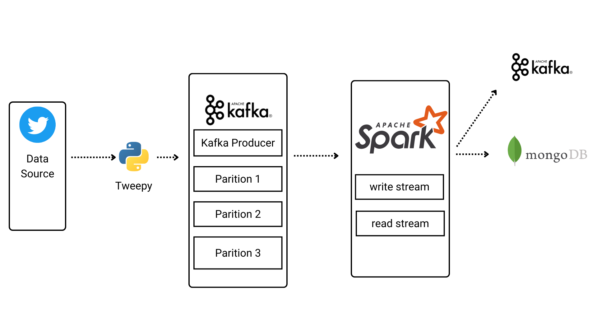
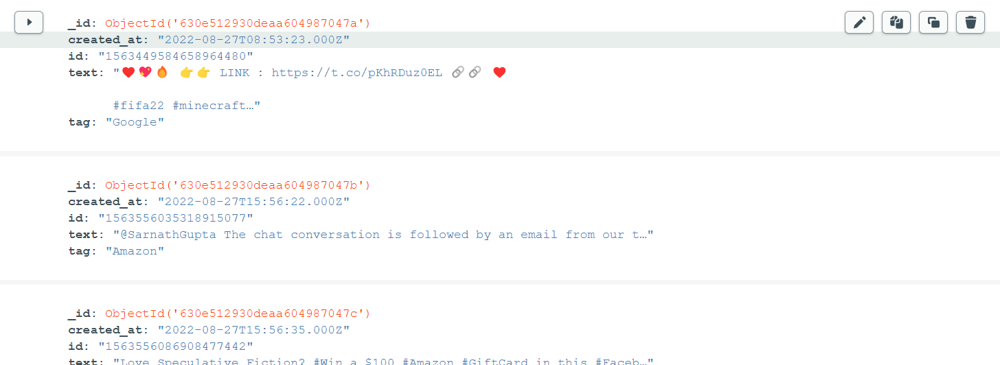

<h1 align="center">
  <b><center>Real Time Streaming of Twitter hashtags using Apache Spark Structured Streaming<br></b></center>
</h1>
<p align="center">
  


</p>

### Introduction
This project fetches recent tweets based on keywords about FAANG companies by Twitter API v2. Using Kafka to send tweets to Apache Spark Structured Streaming for processing. After that the data will send to MongoDB
### Working of the project

### Requirement
- Python 3.8, WSL2
- Twitter API v2 (tweepy)
- Kafka 2.8.0
- Spark 3.0.2
- MongoDB
### File and Folder Structure
- `config.json`: make rule to tweets streaming. Change to specify topics in https://github.com/twitterdev/twitter-context-annotations
- `.env`: Twitter bearer token, mongodb connection string
- `twitter_spark_to_kafka.py`: write stream after processing to kafka
- `twitter_spark_console.py`: check the streaming in your console
### Running the Application
1.First step run kafka
`Start zookeeper`
```
zookeeper-server-start.sh ~/kafka_2.12-2.8.0/config/zookeeper.properties
```
`Start kafka server`
```
kafka-server-start.sh ~/kafka_2.12-2.8.0/config/server.properties
```
`Read Kafka topic`
```
kafka-console-consumer.sh --bootstrap-server localhost:9092 --topic twitter_streaming
```
2.Run `twitter_connect.py` file
```
cd twitter_api
python2 twitter_connect.py
```
3.Run PySpark
```
cd pyspark/mongodb
spark-submit --packages org.apache.spark:spark-sql-kafka-0-10_2.12:3.0.2,org.apache.spark:spark-streaming-kafka-0-10_2.12:3.0.2,org.mongodb.spark:mongo-spark-connector_2.12:3.0.2 twitter_spark.py localhost:9092 subscribe twitter_streaming
```
### Final Output

